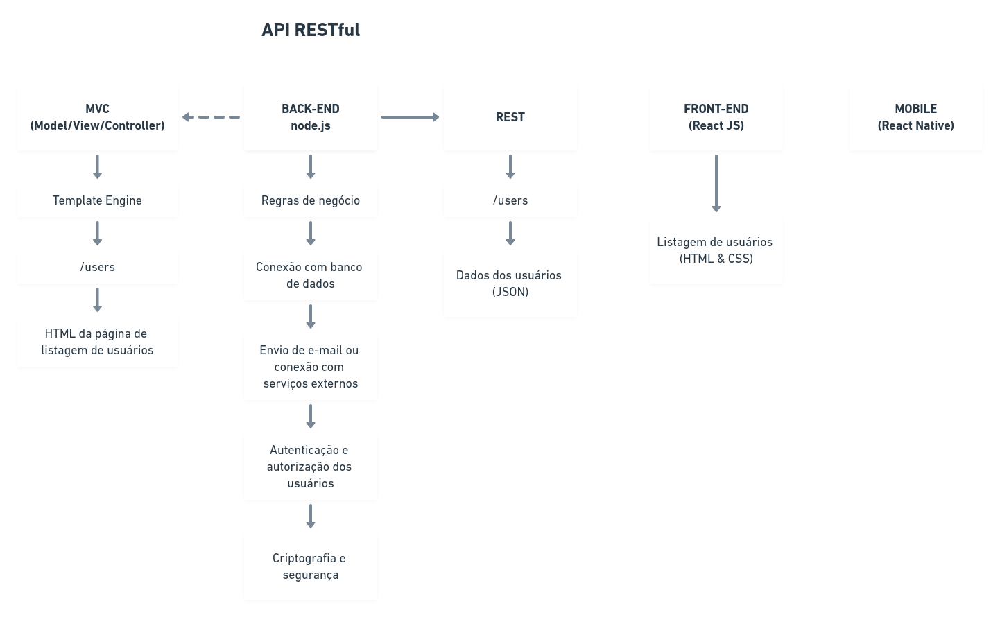
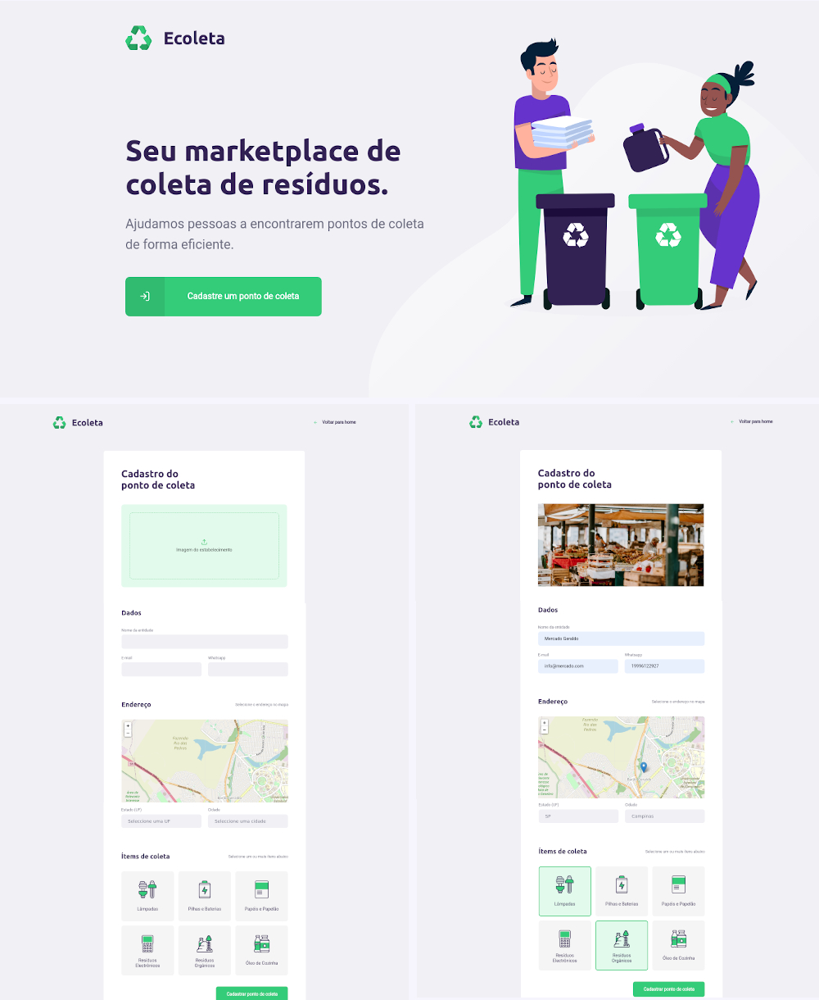
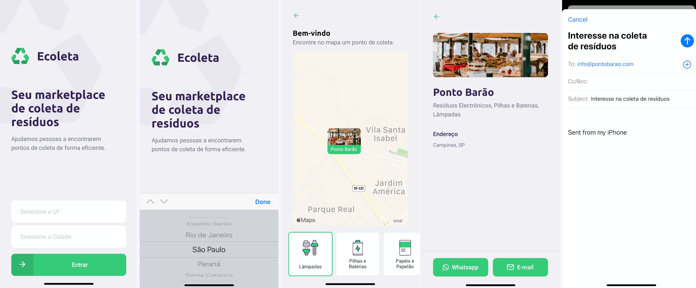

# Next Level Week | Ecoleta

**Ecoleta** é um projeto desenvolvido na **Next Level Week 1.0**. O objetivo é conectar pessoas a empresas que coletam resíduos específicos, como lâmpadas, baterias, óleo de cozinha etc.

## API



## Ambiente de desenvolvimento

As seguintes tecnologias foram utilizadas no projeto:

* **Back-end**

	* [TypeScript](https://www.typescriptlang.org/)
	* [Node.js](https://nodejs.org/)
  * [KnexJS](http://knexjs.org/)
  * [Sqlite3](https://www.sqlite.org/index.html)


* **Front-end**

	* [React.js](https://reactjs.org/)
	* [TypeScript](https://www.typescriptlang.org/)
	* [Leaflet](https://leafletjs.com/)
  * [Axios](https://github.com/axios/axios)


* **Mobile**

	* [React Native](https://reactnative.dev/)
	* [Expo](https://expo.io/)

## Instalação API

* Clonar este repositório

```
git clone git@github.com:mafda/nlw_ecoleta.git
```

### Back-end

* Entre no repositório
  
```
cd nlw_ecoleta/server
```

* Run
  
```
npm install
npm run knex:migrate
npm run knex:seed
```
* Start

```
npm run dev
```

### Front-end

* Entre no repositório
  
```
cd nlw_ecoleta/web
```

* Run
  
```
npm install
```
* Start

```
npm start
```

### Mobile

* Entre no repositório
  
```
cd nlw_ecoleta/mobile
```

* Run
  
```
npm install
```
* Start

Para visualizar, instale [Expo](https://expo.io/).

```
npm start
```


## Resultados

### Aplicação Web



### Aplicação Mobile



## Insomnia

Para testar o projeto *"Ecoleta"*, instale o [Insomnia](https://insomnia.rest/) ou execute via docker container [docker-insomnia](https://github.com/camiloariza/docker-insomnia).

### Agradecimentos

[Diego Fernandes](https://github.com/diego3g) e a equipe da [RocketSeat](https://rocketseat.com.br/).


--- 

made with 💙 by [mafda](https://mafda.github.io/)
